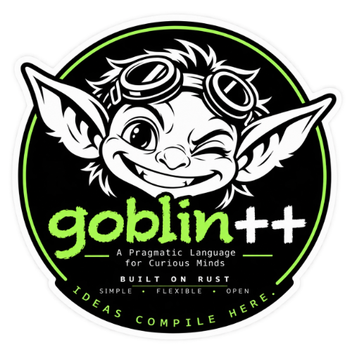

# Goblin++ Rust Engine 0.1.0-alpha.12



Goblin++ is an evidence-first scientific language. This release begins the audited migration from the Python 0.0.7 reference implementation to a native Rust engine.

> **Privacy warning:** Run evidence can preserve source code, `input()` prompts
> and responses, command-line arguments, imported FITS data, generated files,
> and stdout/stderr in plaintext. Do not use passwords, tokens, or confidential
> research data without reviewing where that evidence is stored and who can
> access it. `GO_PARANOID` and SHA-256 protect integrity, not confidentiality.
> See [Security and trust boundaries](docs/SECURITY.md).

## Downloads and documentation

- [Goblin++ Alpha.12 Day-One Tutorial](docs/tutorial/Goblin++_Alpha12_Day-One_Tutorial.pdf)
- [Install the VS Code extension](vscode/README.md)

The ordinary command interprets a saved `.gbl` file:

```console
goblin++ experiment.gbl
```

Native compilation is explicit:

```console
goblin++ experiment.gbl --compile
goblin++ compile experiment.gbl -o experiment
```

The first form runs the native artifact and preserves the generated Rust, compiled binary, stdout, stderr, sealed scientific artifacts, and hashes in the run directory. The second form produces a standalone binary without running it.

## Repository status

This source repository includes the Rust engine, its tests and examples, and the
VS Code extension in [`vscode/`](vscode/). It does **not** contain a prebuilt
binary, personal run directories, or scientific input data beyond the small
deterministic FITS test fixture. It is being prepared for an eventual public
alpha release; the remaining gates are in
[RELEASE_CHECKLIST.md](RELEASE_CHECKLIST.md).

## Build and install

Rust 1.92 or newer is required.

```console
cargo test --locked
./install.sh --prefix "$HOME/.local"
goblin++ --version
```

This source checkout builds the command locally using the checked-in lockfile.
The installer uses a bundled macOS arm64 binary only when one is present in a
separate release archive; it builds from source here. You may pass
`--build-from-source` to make that choice explicit.

Cargo's internal binary target is named `goblinpp` because Rust crate identifiers cannot contain `+`. The installer exposes the intended command name, `goblin++`.

## Everyday and paranoid programs

Neither `GO_PARANOID` nor `seal` is required for an everyday program:

```goblin
samples = 12
accepted = 9
fraction = accepted / samples
print("accepted fraction = {fraction:.3f}")
write_text("answer.txt", "fraction = {fraction:.3f}")
```

The generated file remains confined to the unique `RUN_DIR/outputs` directory and is recorded and verified by SHA-256. Completed runs preserve source, logs, and a receipt; cleanly verified runs are registered in the checksum ledger. A failed paranoid self-check blocks ledger registration. `seal` is an optional declaration that snapshots a named scientific value as its own typed artifact; it is not needed for `print` or file output.

`GO_PARANOID` is an opt-in stricter evidence policy. It is source syntax and part of the canonical program:

```goblin
GO_PARANOID

mass = 1 kg
energy = mass * c^2
print("Energy = {energy}")
seal energy
```

In addition to baseline evidence, paranoid runs observe and preserve the source bytes again after execution. A different end-of-run hash refuses `PASS` and records a verifiable protocol violation; a missing source also refuses `PASS`. The receipt is independently checked before ledger registration. This is an end-of-run observation, not continuous monitoring: edits restored before that check cannot be detected by it. Frozen-byte enforcement, output confinement, data hashing, and exact-hash authorization for arbitrary inline Rust apply in either mode. `GO_PARANOID` is not an OS sandbox; see [SECURITY.md](docs/SECURITY.md).

## Everyday control flow

`for`, `while`, `break`, `continue`, `if`/`else if`/`else`, and `switch`/`case`/`default` are Goblin++ syntax in both interpreter and compiled mode; no Python or inline Rust is needed. Boolean expressions use short-circuit `and`, `or`, and `not`:

```goblin
GO_PARANOID
total = 0
for i in range(1, 6) {
    if i % 2 == 0 {
        continue
    }
    total = total + i
}
for value in [2, 4, 6] {
    if value > 4 { break }
    total = total + value
}
remaining = 3
while remaining > 0 {
    remaining = remaining - 1
}
print("total = {total}")
seal total

if total > 10 and not total == 99 {
    verdict = "high"
} else {
    verdict = "low"
}
switch verdict {
    case "high" { code = 1 }
    default { code = 0 }
}
print("verdict = {verdict}; code = {code}")
```

`range` uses a half-open stop and accepts one, two, or three dimensionless integer arguments. `for value in array` iterates an independent array value. `%` is checked integer remainder and follows the dividend's sign. Comparisons and Boolean operators never infer numeric truthiness. `switch` uses exact, dimension-aware equality, first match, and no fallthrough. Nested loops share a one-million-iteration run limit, and exceeding it creates a preserved, verifiable failure. See [CONTROL_FLOW.md](docs/CONTROL_FLOW.md) and `examples/everyday_alpha12.gbl`.

## G funk: user-defined functions

Declare a function with `g_func`, then call it by name. `return` supplies its value:

```goblin
g_func energy(mass) {
    return mass * c^2
}

result = energy(1 kg)
print("Energy = {result}")
seal result
```

Functions work in the interpreter and native compiler. They may be declared after their call site. Parameters and local assignments stay inside the function; array arguments are independent copies. Every reached path must return a value. Recursion is limited to 16 active calls. Keep `GO_PARANOID`, `seal`, and authorized inline Rust at top level; seal the returned result in the caller. Interpreted functions may read FITS and write run-confined outputs, but native compilation still refuses those built-ins. See [FUNCTIONS.md](docs/FUNCTIONS.md) and `examples/functions.gbl`.

## Interaction and arrays

`input("prompt")` reads text; `argc` and `argv(i)` expose command-line arguments after `--`. Interaction evidence is preserved, so never enter secrets. Arrays support `[]`, indexing, indexed assignment, half-open slicing, `len`, copy-returning `append`, and direct `for value in array` iteration. Slices and iteration values are **independent copies**, not Go-style shared views. See [INTERACTION_AND_ARRAYS.md](docs/INTERACTION_AND_ARRAYS.md), `examples/greeting.gbl`, `examples/program_args.gbl`, and `examples/arrays.gbl`.

```goblin
greeting = input("Please enter your name:")
print("Hello, {greeting}!")
```

## Text operations: g_strings without a new mode

Text values now support `+` for concatenation and `len(text)` for Unicode-scalar length. `parse_number(text)` explicitly converts finite, unitless decimal input; `parse_integer(text)` accepts only signed or unsigned decimal integers within the exact `f64` range. `to_text(value)` renders a value for labels. `str_trim`, `str_contains`, `str_replace`, `str_split`, and `str_join` cover everyday text work in both execution modes:

```goblin
name = str_trim("  Ada  ")
message = "Hello, " + name
answer = parse_number("2.5") * 2
count = parse_integer("42")
print("{message}; answer = {answer}")
```

This is not a new `g_strings` type: it is a small, explicit set of operations on existing text values. Neither parser accepts units or integers beyond ±(2^53−1). See [STRINGS.md](docs/STRINGS.md) and `examples/strings.gbl` for the full contract.

## Native scientific data import

Inspect an unfamiliar FITS file before writing a program:

```console
goblin++ fits-info catalogue.fits --quick
goblin++ fits-info catalogue.fits --json
```

`--quick` reads only structural headers and explicitly reports that no checksum was computed. Without it, `fits-info` streams the entire file through SHA-256. Neither form creates run evidence.

The native importer handles primary images, image extensions, and fixed-width binary tables without Python or CFITSIO. HDU and row indexes are zero-based; image-axis indexes retain the FITS one-based convention:

```goblin
hdus = fits_hdu_count("catalogue.fits")
name = fits_header("catalogue.fits", 1, "EXTNAME")
rows = fits_rows("catalogue.fits", 1)
columns = fits_columns("catalogue.fits", 1)
first_class = fits_column("catalogue.fits", 1, "CLASS", 0)
mean_z = fits_column_mean("catalogue.fits", 1, "Z")
minimum_z = fits_column_min("catalogue.fits", 1, "Z")
maximum_z = fits_column_max("catalogue.fits", 1, "Z")
valid_z = fits_column_valid_count("catalogue.fits", 1, "Z")
stats = fits_select_stats("catalogue.fits", 1, "Z", 0.4, 0.6, "Z", "WEIGHT")
```

Existing primary-image calls remain valid. Each also accepts an explicit HDU:

```goblin
width = fits_axis("observation.fits", 0, 1)
pixels = fits_count("observation.fits", 0)
first = fits_pixel("observation.fits", 0, 0)
mean = fits_mean("observation.fits", 0)
```

Image values support `BITPIX` 8, 16, 32, 64, -32, and -64. `BSCALE`, `BZERO`, and integer `BLANK` are honored. Binary-table access supports `L`, `B`, `I`, `J`, `K`, `A`, `E`, and `D` fixed-width columns, including repeats, `TSCAL`, `TZERO`, and integer `TNULL`. Numeric statistics skip null integers and floating-point NaNs and use compensated summation.

`fits_select_stats` adds a bounded, full-table summary with an explicit
half-open numeric selection and optional positive weights. Its four-element
result reports selected rows, usable rows, sum of weights, and weighted mean;
it does not choose survey cuts or weights for you. See [FITS.md](docs/FITS.md)
and `examples/fits_selection.gbl` before using it for scientific work.

Inputs are opened read-only and processed with bounded memory. A run streams the entire input through SHA-256 and preserves a second verified copy in `.goblin/imports/SHA256.fits`; run directories hard-link that checksum-addressed object when the filesystem permits, avoiding one full duplicate per run. The bundled `examples/sample.fits` is deterministic and reproducible with `tools/generate_sample_fits.rs`.

ASCII tables can be discovered but not read. Random groups, compressed images, bit columns, complex columns, variable-length arrays, WCS interpretation, automatic unit conversion, and compiled FITS calls remain explicit limits.

See [FITS.md](docs/FITS.md) for the complete function and evidence contract.

## Audited files and plots

Generated files are run artifacts, not untracked side effects. They are written beneath `RUN_DIR/outputs`, recorded with their media type, size, producer, metadata, and SHA-256, and independently checked by `verify`.

```goblin
write_text("summary.txt", "rows = {rows}", "mean Z = {mean_z}")
write_csv("summary.csv", 2, "metric", "value", "rows", rows, "mean_z", mean_z)
write_tsv("summary.tsv", 2, "metric", "value", "rows", rows)
write_json("summary.json", "rows", rows, "mean_z", mean_z)

plot_fits_histogram("redshift.png", file, 1, "Z", 40, 50000, "Sampled redshift distribution")
plot_fits_scatter("z_error.svg", file, 1, "Z", "Z_ERR", 50000, "Redshift and reported error")
```

FITS plots use deterministic even-row sampling and preserve the sample method and counts in the receipt. SVG and PNG are supported. JPEG is intentionally omitted from the authoritative path because it is lossy. Filenames cannot escape the run directory, duplicate declarations are refused, and each output is capped at 64 MiB in this first stage.

Generated-output calls work with or without `GO_PARANOID`; the same confinement, duplicate-name refusal, size caps, and verification apply in both modes.

See [OUTPUTS.md](docs/OUTPUTS.md), `examples/everyday.gbl`, and the executable `examples/output_demo.gbl` tutorial.

## Inline Rust

Inline Rust is arbitrary native code. It therefore uses visible boundaries and exact-byte authorization:

```goblin
GO_PARANOID
x = 1

RUST_INLINE_BEGIN
println!("reviewed native operation");
RUST_INLINE_END

seal x
```

First obtain the block hash without executing it:

```console
goblin++ check program.gbl
```

Then review the block and authorize precisely that digest:

```console
goblin++ program.gbl --compile \
  --allow-inline-rust FULL_64_CHARACTER_SHA256
```

Changing one byte changes the digest and returns the policy to refusal. Inline blocks execute in source order and may read the generated `goblin_env`; the alpha contract does not let them mutate sealed Goblin++ variables. Interpreter mode always refuses inline Rust.

## Custody workflow

```console
goblin++ freeze experiment.gbl
goblin++ experiment.gbl
goblin++ verify experiment-runs/RUN_DIRECTORY

goblin++ revise experiment.gbl experiment_R1.gbl \
  --reason "document the scientific reason"
```

Frozen source changes fail before evaluation. A notation-only edit is still a protocol violation because freezing commits exact bytes, but its unchanged canonical meaning is reported separately. Refusals are preserved as verifiable runs.

Useful inspection commands are `check`, `fits-info`, `status`, `lineage`, `audit-ledger`, `doctor`, `diff`, and `capabilities`.

## Release status

This is an alpha foundation, not a declaration that the migration is complete. See [PORTING_MATRIX.md](docs/PORTING_MATRIX.md) and [SECURITY.md](docs/SECURITY.md) before scientific production use.

## Licensing

Goblin++ software, examples, test fixtures, and extension assets are licensed
under [MIT](LICENSE). Original tutorial/documentation prose and diagrams are
licensed under [CC BY 4.0](LICENSE-DOCS.md). Code examples inside the
documentation remain MIT-licensed. The documentation license file gives the
exact file scope; third-party dependencies keep their own licenses. The exact
locked macOS arm64 binary dependency inventory, upstream license files, and
Rust standard-library notices are preserved in
[THIRD_PARTY_NOTICES.md](THIRD_PARTY_NOTICES.md). The
[project logo](assets/goblinpp-logo.png) is separate branding, described in
[BRANDING.md](BRANDING.md), and is not covered by either project license.
