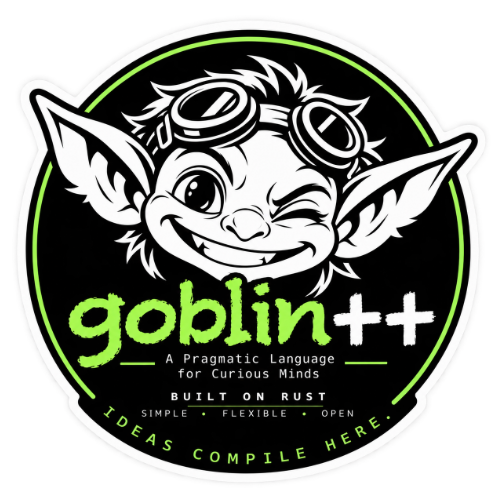

> 简体中文译本；对应 Goblin++ 0.1.0-alpha.21 文档快照。命令、标识符及代码示例保持原样。

# 面向 JetBrains IDE 的 Goblin++

插件 0.3.6 配合引擎 alpha.21。补全帮助说明默认无损数值文本和带符号零，并将常数标记为只读，要求使用 `append` 的返回结果，以及说明源模板值的立即捕获。参见引擎包内的 `docs/PROTECTED_VALUES.md`。



本插件为 IntelliJ Platform IDE 增加 Goblin++ 语言和工作流支持。它刻意保持为真实 Rust 引擎外围的轻量编辑器集成：插件不重新实现科学执行或保管规则。

## 初始功能集

- `.gbl` 识别和 Goblin++ 文件图标；
- 在基于 IntelliJ 的 IDE（包括 PyCharm 和 CLion）中通过 **New Project | Goblin++**（新建项目）生成项目；
- 可审计（`GO_PARANOID`）或日常起始模式；
- 原生 **Run**（运行）配置，支持工具栏、上下文菜单、快捷键和编辑器行号栏执行；
- 交互控制台输入，以及用于 `argc`/`argv` 的带引号程序参数；
- 由词汇表驱动的语法高亮；
- 关键字、函数、常数和单位补全；
- 来自当前编辑器词汇表的快速文档；
- 化学与电学 `chem_`/`ee_` 补全，包括 Unicode SI 单位；
- 保持量纲的 `sum`/`mean` 补全和帮助（需要 alpha.19 引擎）；
- 本地 `import` 和显式 CSV/TSV 读取器的补全／帮助（alpha.19）；
- `()`、`[]` 和 `{}` 配对，以及 `#` 行注释；
- **Tools | Goblin++**（工具）下的 **Run**、**Compile and Run**、**Check**、**Freeze**、**Status** 和 **Doctor** 操作，分别用于运行、编译运行、检查、冻结、状态和环境诊断；
- 按 `PROJECT/target/release/goblin++`、`~/.local/bin/goblin++`、`PATH` 的顺序查找可执行文件；
- 在 **Settings | Tools | Goblin++**（设置 → 工具）下显式指定可执行文件。

编辑器词汇表在构建时由 [`../vscode/spec/rust-alpha19-editor.json`](../vscode/spec/rust-alpha19-editor.json) 和 [`../vscode/spec/lexicon.v0.json`](../vscode/spec/lexicon.v0.json) 生成。这样可以让 JetBrains 插件与经过审核的 Goblin++ 编辑器约定保持一致，而不是维护另一份手工复制的关键字列表。

## 构建

插件面向 IntelliJ Platform 构建 243（2024.3）或更新版本，需要原生 JDK 21 和 Gradle 8.x：

```console
cd jetbrains
./gradlew clean test buildPlugin
```

可安装的 ZIP 生成于 `build/distributions/`。

## 本地安装

1. 在兼容的 JetBrains IDE 中打开 **Settings | Plugins**（设置 → 插件）。
2. 使用齿轮菜单，选择 **Install Plugin from Disk…**（从磁盘安装插件）。
3. 选择 `build/distributions/` 中的 ZIP。
4. 如有要求，重启 IDE。
5. 打开 `.gbl` 文件并使用 **Tools | Goblin++**。

创建项目时，选择 **File | New Project**（文件 → 新建项目），选择 **Goblin++**，决定起始文件是否包含 `GO_PARANOID`，然后点击 **Create**（创建）。向导会写入 `main.gbl`、`README.md`，以及适合 Goblin++ 运行证据和生成构建文件的 `.gitignore`。

运行程序时，打开 `.gbl` 文件并点击编辑器行号栏内的绿色三角形，或右键选择 **Run**，或使用 IDE 的运行快捷键。Goblin++ 输出和 `input()` 提示显示在 **Run** 面板中。持久化的程序参数和工作目录可在 **Run | Edit Configurations**（运行 → 编辑配置）下编辑。

Goblin++ 本身必须另行安装。插件绝不会下载或暗中替换科学引擎。

## 信任边界

编辑器高亮与补全是编写辅助，不是科学证据。只有 Goblin++ 引擎定义执行、量纲、保管、冻结和验证语义。`GO_PARANOID` 不是沙箱。内联 Rust 仍是按确切哈希授权的任意原生代码。

## 品牌与许可

插件源码和功能性编辑器资源采用 MIT 许可证。Goblin++ 项目标志属于单独的品牌资源，由 `artwork/BRANDING.md` 管理；将其纳入本官方包，并不授予第三方将无关项目冠以 Goblin++ 品牌的权限。
